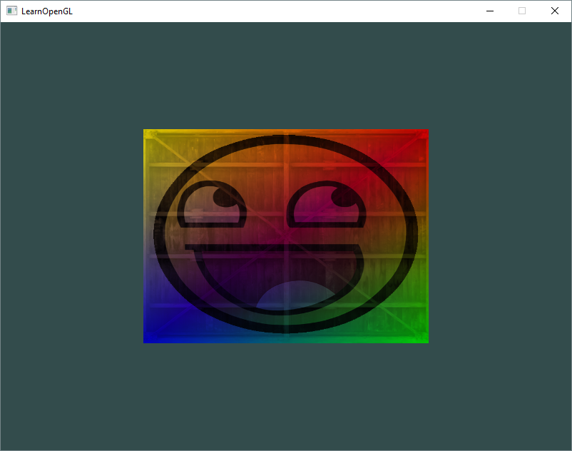

# OpenGLTutorial
Following tutorial from http://learnopengl.com/.

## Dependencies
1. Python 3.4+
1. CMake 3.3+

## Setup
cmake must be on the PATH.

## Build
1. Generate: `python Source/BuildScripts/generate.py`
1. Build: one of
    * `python Source/BuildScripts/build.py`
    * Open the generated project with the appropriate generator (Visual Studio, XCode, etc.) and build it there.

## Run
1. Change the working directory to the location of the executable.  In Visual Studio, do this by setting `GettingStarted properties > Debugging > Working Directory` to `$(TargetDir)`.
1. Run `GettingStarted.exe`.
